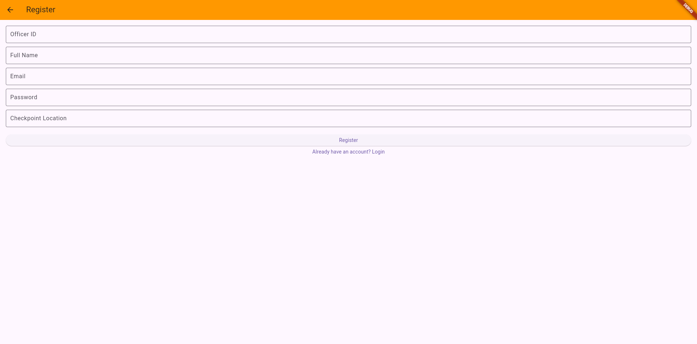
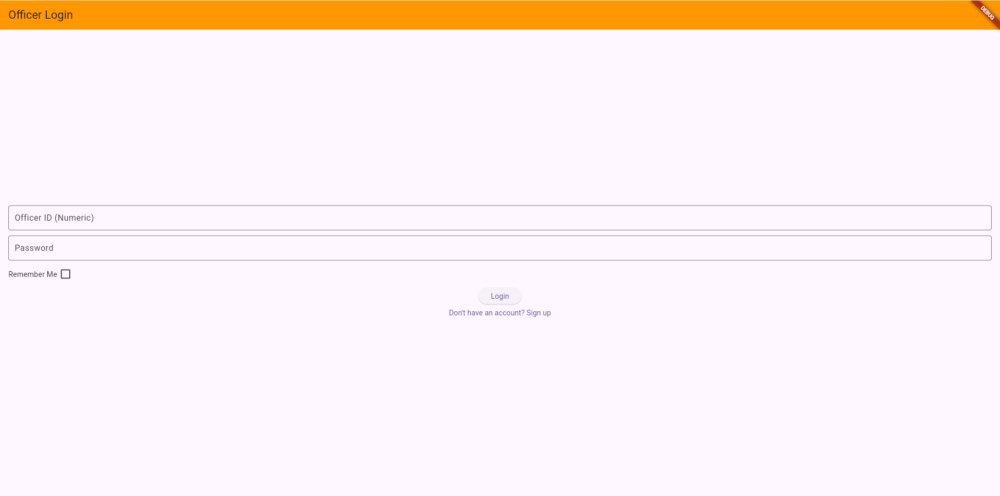
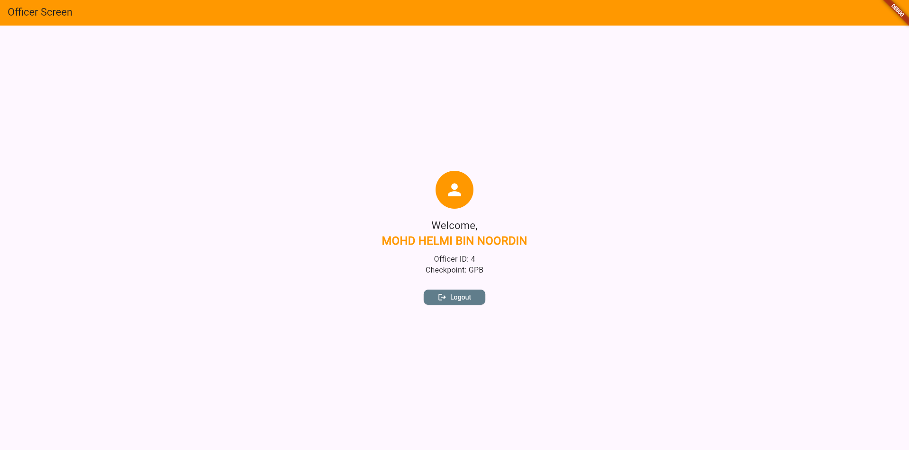
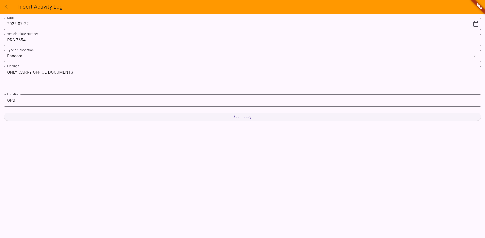
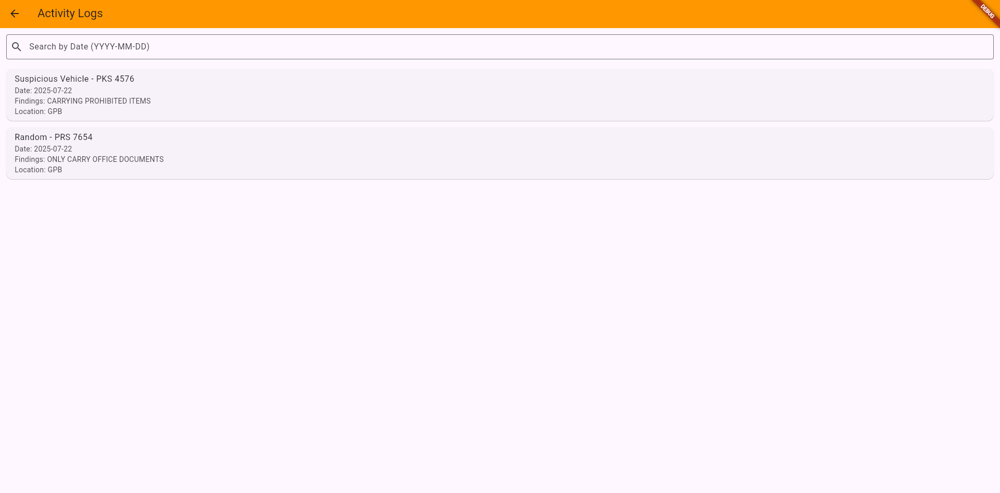
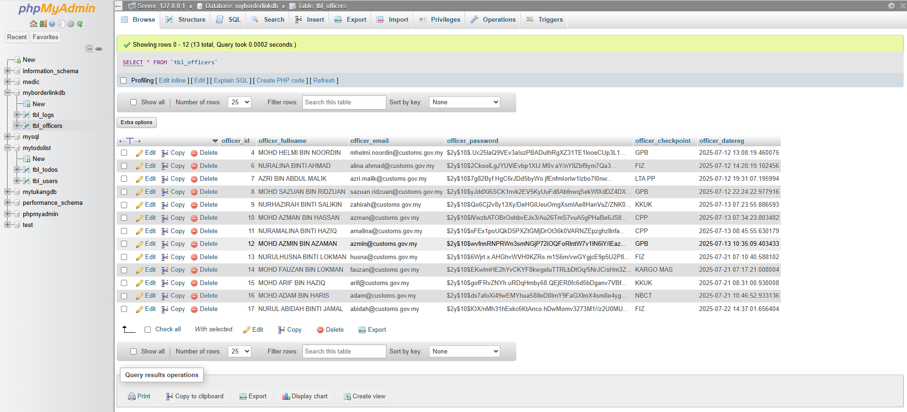
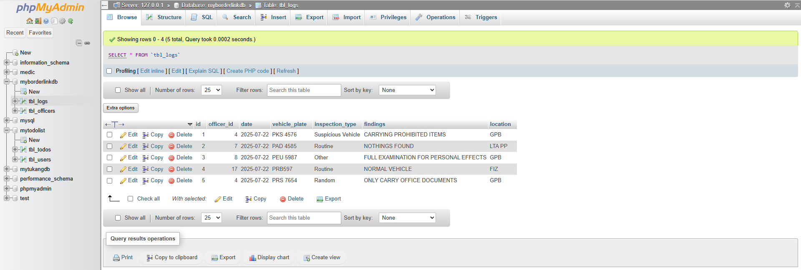
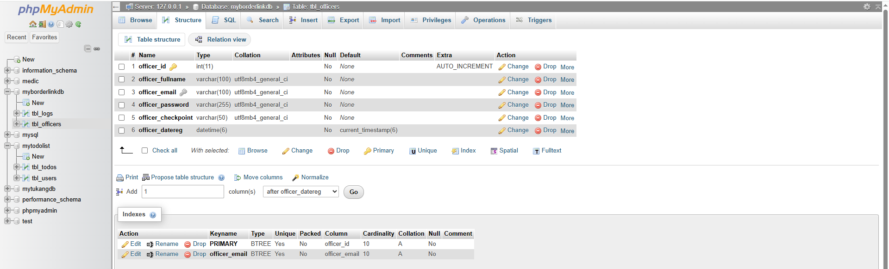
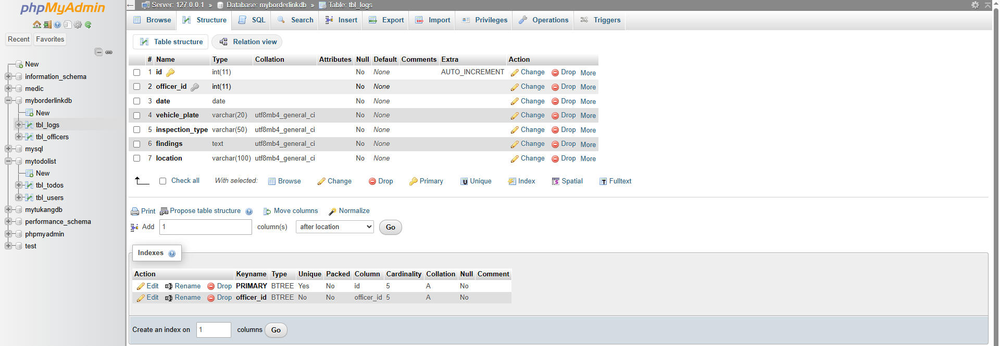

🚧 MyBorderLink App With Activity Reporting Module
A simple MyBorderLink App built with Flutter, PHP, and MySQL that allows customs officers to register, log in at an appointed checkpoint, perform daily activities, and view log actvities.


📱 App Purpose and Features
MyBorderLink is a mobile application designed for use by customs officers to securely register, log in, and manage their duty assignments at appointed checkpoints. It simplifies officer authentication and provides a user-friendly interface for identity verification.

✨ Key Features:

•	🔐 Officer Registration
o	Collects Officer ID (numeric), Full Name, Email, Password, and Checkpoint
o	Validates inputs and enforces strong password rules
o	Stores passwords securely using PHP password_hash()

•	🔓 Secure Login
o	Officers log in using Officer ID and password
o	Credentials are verified via the PHP backend using password_verify()
o	On success, officer details are loaded to the homepage

•	📄 Homepage
o	Displays officer’s full name, ID, checkpoint, perform daily activities, and view log actvities.
o	Includes a clearly positioned Logout button
o	Prevents navigating back to login using system back button

•	💾 "Remember Me" Feature
o	Uses SharedPreferences to save login credentials locally (optional)
o	Automatically fills in saved data on app start

•	🛡️ Backend & Security
o	Passwords are never stored or sent in plain text
o	All user actions are validated
o	Duplicate email or ID is prevented during registration


📄 Code Explanations for MyBorderLink
Below explanation of the key Flutter, PHP, and MySQL components used in the MyBorderLink officer registration and login.
________________________________________
📱 Flutter App Code Explanation
1. Splash Screen (splashscreen.dart)
•	Shows branding and slogan.
•	Uses a 4-second Timer to auto-navigate to the login screen.
Timer(const Duration(seconds: 4), () {
  Navigator.pushReplacement(
    context,
    MaterialPageRoute(builder: (context) => const LoginScreen()),
  );
});
________________________________________
2. Login Screen (loginscreen.dart)
•	Inputs: Officer ID (numeric), Password
•	Validates input and shows errors.
•	Sends POST request to login_user.php
•	Uses SharedPreferences for “Remember Me”
final response = await http.post(
  Uri.parse('${MyConfig.apiUrl}login_user.php'),
  headers: {"Content-Type": "application/json"},
  body: jsonEncode({'officer_id': officerId, 'password': password}),
);
•	On success, it redirects to MainScreen() with user info.
________________________________________
3. Register Screen (registerscreen.dart)
•	Inputs: Officer ID, Full Name, Email, Password, Checkpoint
•	Validates all fields, sends POST to register_user.php
•	Displays success/failure messages
final response = await http.post(
  Uri.parse('${MyConfig.apiUrl}register_user.php'),
  body: jsonEncode({
    'officer_id': officerId,
    'full_name': fullName,
    'email': email,
    'password': password,
    'checkpoint_location': checkpoint,
  }),
);
________________________________________
4. Main Screen (mainscreen.dart)
•	Displays officer’s name, ID, and checkpoint.
•	Contains logout button at the bottom.
•	Prevents back navigation with WillPopScope
________________________________________
5. Log Model (log_model.dart)

•	Model Definition:

o	This file defines a LogEntry model, which represents the structure of a log entry in the app. It holds properties like:

	date: the date of the log
	vehiclePlate: the plate number of the vehicle
	inspectionType: type of the inspection conducted
	findings: details of the inspection findings
	location: where the inspection took place
	officerId: the ID of the officer who performed the inspection

•	Methods:
o	toJson(): Converts the LogEntry object into a JSON format to be sent in an API request.

Map<String, dynamic> toJson() => {
  'date': date,
  'vehicle_plate': vehiclePlate,
  'inspection_type': inspectionType,
  'findings': findings,
  'location': location,
  'officer_id': officerId,
};

o	fromJson(): Converts JSON data (usually from a server response) back into a LogEntry object.

factory LogEntry.fromJson(Map<String, dynamic> json) {
  return LogEntry(
    date: json['date'] ?? '',
    vehiclePlate: json['vehicle_plate'] ?? '',
    inspectionType: json['inspection_type'] ?? '',
    findings: json['findings'] ?? '',
    location: json['location'] ?? '',
    officerId: json['officer_id'],
  );
}

•	Purpose:

o	This model ensures that data related to logs can be easily serialized and deserialized, which is critical for network communication (API calls) and data management.

_______________________________________
6. Log Insertion Screen (loginsertionscreen.dart)

Features and Functionality:

•	Inputs:

o	Date (uses a date picker for easy selection)
o	Vehicle Plate (text field)
o	Inspection Type (dropdown selection)
o	Findings (text field for details)
o	Location (text field)

•	Input Validation:

o	Validates fields before submission to ensure data integrity. Use Form and TextFormField with validation rules (e.g., checking if fields are empty or formatted correctly).

•	Sending POST Request:
o	Sends the log data (date, vehicle plate, inspection type, findings, and location) to the server for insertion into the database.
o	The request is structured as:
	final response = await http.post(
  	Uri.parse('${MyConfig.apiUrl}insert_log.php'),
  	headers: {"Content-Type": "application/json"},
  	body: jsonEncode({
    	'date': date,
    	'vehicle_plate': vehiclePlate,
    	'inspection_type': inspectionType,
    	'findings': findings,
    	'location': location,
  	}),
	);

•	Success/Error Handling:

o	Displays success or error messages based on the response from the server using SnackBar.
o	If the insertion is successful, the screen may clear the input fields or show a confirmation message.

•	Navigation:
o	After successful log insertion, it navigate to another screen (e.g., a confirmation or the main screen) based on the requirements.
________________________________________
7. Log Display (logdisplay.dart)

•	Fetching Data:
o	Uses a FutureBuilder to fetch log data from the server. It asynchronously loads the data from the API endpoint and updates the UI accordingly.

•	Inputs:
o	Search Filter: Provides a TextField for users to filter logs by date or other relevant information.

•	Displaying Logs:
o	Displays logs in a ListView, where each entry shows:
	Inspection Type
	Vehicle Plate
	Date
	Findings
	Location

•	Request to Server:
o	The fetchLogs() function sends a GET request to the server to retrieve logs. The API request might look like:

		final response = await http.get(
  		Uri.parse('${MyConfig.apiUrl}fetch_logs.php'),
  		headers: {"Content-Type": "application/json"},
		);
•	Error and Loading States:

o	The app manages different states like loading, error, and empty states using FutureBuilder:

	Loading: Shows a loading indicator while fetching data.
	Error: Displays an error message if the API request fails.
	Empty: If no logs are found, a message can be shown.

•	Navigation:

o	This screen is more about viewing data, so navigation might not be as critical unless need to redirect to another screen for adding new logs or viewing detailed log information.
________________________________________
🔙 MyConfig (myconfig.dart)
•	Stores base API URL:
class MyConfig {
  static const String apiUrl = " http://192.168.100.15/myborderlink/php/";

}
________________________________________
🐘 PHP Backend Code Explanation
1. Database Connection (dbconnect.php)
•	Connects to MySQL database using MySQLi.
•	Used in all backend scripts.
________________________________________
2. Register User (register_user.php)
•	Receives POST data from Flutter.
•	Validates required fields.
•	Checks if officer_id or email already exists.
•	Hashes password before inserting.
$password_hash = password_hash($password, PASSWORD_DEFAULT);
•	On success, returns JSON with status: success
________________________________________
3. Login User (login_user.php)
•	Receives officer ID and password.
•	Queries database for matching officer_id
•	Verifies hashed password using password_verify()
if (password_verify($password, $row['officer_password'])) {
    unset($row['officer_password']);
    sendJsonResponse(['status' => 'success', 'data' => $row]);
}
•	Returns officer info if login is successful.
________________________________________
4. Insert Log (insert_log.php)

<?php

header('Access-Control-Allow-Origin: *');
header('Access-Control-Allow-Headers: Content-Type');
header('Access-Control-Allow-Methods: POST, OPTIONS');
header('Content-Type: application/json');

include_once('dbconnect.php');

$data = json_decode(file_get_contents('php://input'), true);

if (
    !isset($data['officer_id']) ||
    !isset($data['date']) ||
    !isset($data['vehicle_plate']) ||
    !isset($data['inspection_type']) ||
    !isset($data['findings']) ||
    !isset($data['location'])
) {
    sendJsonResponse(['status' => 'failed', 'message' => 'Missing required fields']);
    exit;
}

$officer_id = $data['officer_id'];
$date = $data['date'];
$vehicle_plate = $data['vehicle_plate'];
$inspection_type = $data['inspection_type'];
$findings = $data['findings'];
$location = $data['location'];

$stmt = $conn->prepare("INSERT INTO tbl_logs (officer_id, date, vehicle_plate, inspection_type, findings, location) VALUES (?, ?, ?, ?, ?, ?)");
$stmt->bind_param("isssss", $officer_id, $date, $vehicle_plate, $inspection_type, $findings, $location);

if ($stmt->execute()) {
    sendJsonResponse(['status' => 'success', 'message' => 'Log inserted successfully.']);
} else {
    sendJsonResponse(['status' => 'failed', 'message' => 'Insert failed: ' . $stmt->error]);
}
$stmt->close();
$conn->close();

function sendJsonResponse($response) {
    echo json_encode($response);
}
?>

Purpose: This script inserts a new log into the database with details such as officer_id, date, vehicle_plate, inspection_type, findings, and location.

How it works:

CORS Setup: Similar to the first script, it allows cross-origin requests and sets headers for methods and content type.

Database Connection: It includes the database connection.

Input Validation: It checks if all required fields are provided in the request. If any are missing, it returns an error message.

Insert Query: An INSERT query adds the log data into the tbl_logs table.

Response: After insertion, it returns a success or failure message based on whether the query executed successfully.
________________________________________
5. Log Display(get_logs.php)

<?php

header('Access-Control-Allow-Origin: *');
header('Access-Control-Allow-Headers: Content-Type');
header('Access-Control-Allow-Methods: POST, OPTIONS');
header('Content-Type: application/json');

include_once('dbconnect.php');

$data = json_decode(file_get_contents('php://input'), true);

if (!isset($data['officer_id'])) {
    sendJsonResponse(['status' => 'failed', 'message' => 'Officer ID required.']);
    exit;
}

$officer_id = $data['officer_id'];

$stmt = $conn->prepare("SELECT id, date, vehicle_plate, inspection_type, findings, location FROM tbl_logs WHERE officer_id = ? ORDER BY date DESC");
$stmt->bind_param("i", $officer_id);
$stmt->execute();
$result = $stmt->get_result();

$logs = [];
while ($row = $result->fetch_assoc()) {
    $logs[] = $row;
}

sendJsonResponse(['status' => 'success', 'logs' => $logs]);

$stmt->close();
$conn->close();

function sendJsonResponse($response) {
    echo json_encode($response);
}
?>

Purpose: This script retrieves logs from the database based on the officer_id passed in the request.

How it works:

CORS Setup: It includes headers to allow cross-origin requests and specify accepted methods.

Database Connection: The script includes a database connection file (dbconnect.php).

Input Validation: It checks if officer_id is provided in the request. If not, it returns a failure message.

Database Query: A SELECT query fetches logs from tbl_logs where the officer_id matches, ordered by date in descending order.

Sending Response: The results are returned as a JSON response containing the logs.

Closing Connections: It closes the database connection and the prepared statement.

________________________________________
🗃️ MySQL Table: tbl_officers

CREATE TABLE `tbl_officers` (
  `officer_id` int(11) NOT NULL,
  `officer_fullname` varchar(100) NOT NULL,
  `officer_email` varchar(100) NOT NULL,
  `officer_password` varchar(255) NOT NULL,
  `officer_checkpoint` varchar(50) NOT NULL,
  `officer_datereg` datetime(6) NOT NULL DEFAULT current_timestamp(6)
) ENGINE=InnoDB DEFAULT CHARSET=utf8mb4 COLLATE=utf8mb4_general_ci;

•	officer_password is stored in hashed format.
•	officer_id must be unique and integer.
________________________________________
🗃️ MySQL Table: tbl_logs

CREATE TABLE tbl_logs (
    id INT AUTO_INCREMENT PRIMARY KEY,
    officer_id INT NOT NULL,
    date DATE NOT NULL,
    vehicle_plate VARCHAR(20) NOT NULL,
    inspection_type VARCHAR(50) NOT NULL,
    findings TEXT NOT NULL,
    location VARCHAR(100) NOT NULL,
    FOREIGN KEY (officer_id) REFERENCES tbl_officers(officer_id)
) ENGINE=InnoDB DEFAULT CHARSET=utf8mb4 COLLATE=utf8mb4_general_ci;

________________________________________
🗃️ ERD

+-----------------+               +-------------------+
|   tbl_officers  |               |     tbl_logs      |
+-----------------+               +-------------------+
| officer_id (PK) | <--------+     | id (PK)           |
| officer_fullname|           |     | officer_id (FK)   |
| officer_email   |           |     | date              |
| officer_password|           |     | vehicle_plate     |
| officer_checkpoint |        |     | inspection_type   |
| officer_datereg |           |     | findings          |
+-----------------+           |     | location          |
                              |     +-------------------+
                              |
                              +-> One-to-Many (One Officer can have many Logs)

Relationship Between tbl_officers and tbl_logs:

One-to-Many: One officer can have multiple logs. This is shown by the foreign key officer_id in tbl_logs referencing officer_id in tbl_officers.


________________________________________
📸 Screenshots

| Splash Screen | Register Screen |
|---------------|------------------------|
|  |  |


| Login Screen | Officer Screen |
|---------------|------------------------|
|  |  |


| Activity Screen | Log Screen |
|---------------|------------------------|
|  |  |


| Table Officers | Table Log  |
|---------------|------------------------|
|  |  |


| Table Structure - Officers | Table Strcuture - Log  |
|---------------|------------------------|
|  |  |


## 🚀 How to Run the App

1. **Clone the repo**
   ```bash
   git clone https://github.com/yourusername/myborderlink.git
   cd myborderlink


This assignment helped me to understand several Flutter concepts:

•  Connecting Flutter with PHP backend via HTTP POST
•  Form validation and user feedback using TextEditingController and SnackBar
•  State management with setState and UI updates
•  Secure password hashing and verification in PHP using password_hash() and password_verify()
•  Session-like persistence with SharedPreferences
•  Ensures that data related to logs can be easily serialized and deserialized, which is critical for network communication (API calls) and data management.


This assignment gave me practical experience with building a functional Flutter application. I learned how to manage app state and lifecycle with StatefulWidget and initState(). Besides, I’m also learned how to connect the Flutter frontend with a PHP/MySQL backend using HTTP requests. It also helped me to understand how to apply password hashing and backend integration using PHP and MySQL. Furthermore, I’m also learned about secure user registration and login functionality using hashed passwords.
In Addidtion, I'm also learned how to ensures that data related to logs can be easily serialized and deserialized, which is critical for network communication (API calls) and data management.
Overall, this assignment strengthened my understanding of Flutter's widget tree, communicating with external APIs and handling JSON responses, UI design principles, and error handling and feedback via SnackBars and conditional loading indicators.
