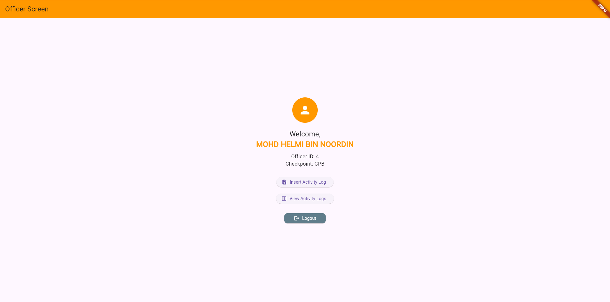

🚧 MyBorderLink App
A simple MyBorderLink App built with Flutter, PHP, and MySQL that allows customs officers to register and log in at an appointed checkpoint.


📱 App Purpose and Features
MyBorderLink is a mobile application designed for use by customs officers to securely register, log in, and manage their duty assignments at appointed checkpoints. It simplifies officer authentication and provides a user-friendly interface for identity verification.

✨ Key Features
•	🔐 Officer Registration
o	Collects Officer ID (numeric), Full Name, Email, Password, and Checkpoint
o	Validates inputs and enforces strong password rules
o	Stores passwords securely using PHP password_hash()
•	🔓 Secure Login
o	Officers log in using Officer ID and password
o	Credentials are verified via the PHP backend using password_verify()
o	On success, officer details are loaded to the homepage
•	📄 Homepage
o	Displays officer’s full name, ID, and checkpoint
o	Includes a clearly positioned Logout button
o	Prevents navigating back to login using system back button
•	💾 "Remember Me" Feature
o	Uses SharedPreferences to save login credentials locally (optional)
o	Automatically fills in saved data on app start
•	🛡️ Backend & Security
o	Passwords are never stored or sent in plain text
o	All user actions are validated
o	Duplicate email or ID is prevented during registration


📄 Code Explanations for MyBorderLink
Below explanation of the key Flutter, PHP, and MySQL components used in the MyBorderLink officer registration and login.
________________________________________
📱 Flutter App Code Explanation
1. Splash Screen (splashscreen.dart)
•	Shows branding and slogan.
•	Uses a 4-second Timer to auto-navigate to the login screen.
Timer(const Duration(seconds: 4), () {
  Navigator.pushReplacement(
    context,
    MaterialPageRoute(builder: (context) => const LoginScreen()),
  );
});
________________________________________
2. Login Screen (loginscreen.dart)
•	Inputs: Officer ID (numeric), Password
•	Validates input and shows errors.
•	Sends POST request to login_user.php
•	Uses SharedPreferences for “Remember Me”
final response = await http.post(
  Uri.parse('${MyConfig.apiUrl}login_user.php'),
  headers: {"Content-Type": "application/json"},
  body: jsonEncode({'officer_id': officerId, 'password': password}),
);
•	On success, it redirects to MainScreen() with user info.
________________________________________
3. Register Screen (registerscreen.dart)
•	Inputs: Officer ID, Full Name, Email, Password, Checkpoint
•	Validates all fields, sends POST to register_user.php
•	Displays success/failure messages
final response = await http.post(
  Uri.parse('${MyConfig.apiUrl}register_user.php'),
  body: jsonEncode({
    'officer_id': officerId,
    'full_name': fullName,
    'email': email,
    'password': password,
    'checkpoint_location': checkpoint,
  }),
);
________________________________________
4. Main Screen (mainscreen.dart)
•	Displays officer’s name, ID, and checkpoint.
•	Contains logout button at the bottom.
•	Prevents back navigation with WillPopScope
________________________________________
🔙 MyConfig (myconfig.dart)
•	Stores base API URL:
class MyConfig {
  static const String apiUrl = " http://192.168.100.15/myborderlink/php/";
}
________________________________________
🐘 PHP Backend Code Explanation
1. Database Connection (dbconnect.php)
•	Connects to MySQL database using MySQLi.
•	Used in all backend scripts.
________________________________________
2. Register User (register_user.php)
•	Receives POST data from Flutter.
•	Validates required fields.
•	Checks if officer_id or email already exists.
•	Hashes password before inserting.
$password_hash = password_hash($password, PASSWORD_DEFAULT);
•	On success, returns JSON with status: success
________________________________________
3. Login User (login_user.php)
•	Receives officer ID and password.
•	Queries database for matching officer_id
•	Verifies hashed password using password_verify()
if (password_verify($password, $row['officer_password'])) {
    unset($row['officer_password']);
    sendJsonResponse(['status' => 'success', 'data' => $row]);
}
•	Returns officer info if login is successful.
________________________________________
🗃️ MySQL Table: tbl_officers
CREATE TABLE tbl_officers (
  officer_id INT PRIMARY KEY,
  officer_fullname VARCHAR(100),
  officer_email VARCHAR(100),
  officer_password VARCHAR(255),
  officer_checkpoint VARCHAR(50),
  officer_datereg DATETIME DEFAULT CURRENT_TIMESTAMP
);
•	officer_password is stored in hashed format.
•	officer_id must be unique and integer.
________________________________________


📸 Screenshots

| Splash Screen | Register Screen |
|---------------|------------------------|
|  |  |


| Login Screen | Officer Screen |
|---------------|------------------------|
|  |  |


🔌 PHP Backend API

register_user.php
Handles officer registration. Validates unique email and officer ID, hashes the password, and inserts into the database.

login_user.php
Handles officer login. Accepts Officer ID and password, verifies the hashed password, and returns user details if successful.


## 🚀 How to Run the App

1. **Clone the repo**
   ```bash
   git clone https://github.com/yourusername/myborderlink.git
   cd myborderlink


This assignment helped me to understand several Flutter concepts:

•  Connecting Flutter with PHP backend via HTTP POST
•  Form validation and user feedback using TextEditingController and SnackBar
•  State management with setState and UI updates
•  Secure password hashing and verification in PHP using password_hash() and password_verify()
•  Session-like persistence with SharedPreferences


This assignment gave me practical experience with building a functional Flutter application. I learned how to manage app state and lifecycle with StatefulWidget and initState(). Besides, I’m also learned how to connect the Flutter frontend with a PHP/MySQL backend using HTTP requests. It also helped me to understand how to apply password hashing and backend integration using PHP and MySQL. Furthermore, I’m also learned about secure user registration and login functionality using hashed passwords. Overall, this assignment strengthened my understanding of Flutter's widget tree, communicating with external APIs and handling JSON responses, UI design principles, and error handling and feedback via SnackBars and conditional loading indicators.

